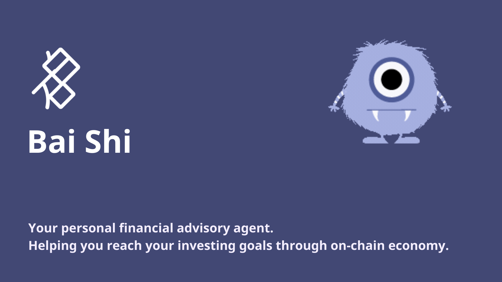
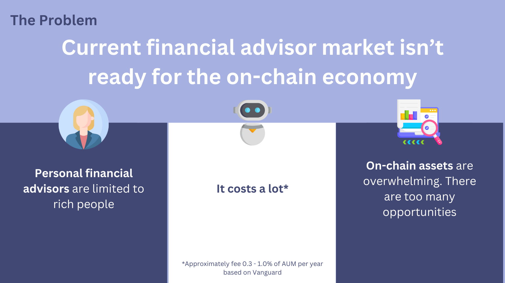
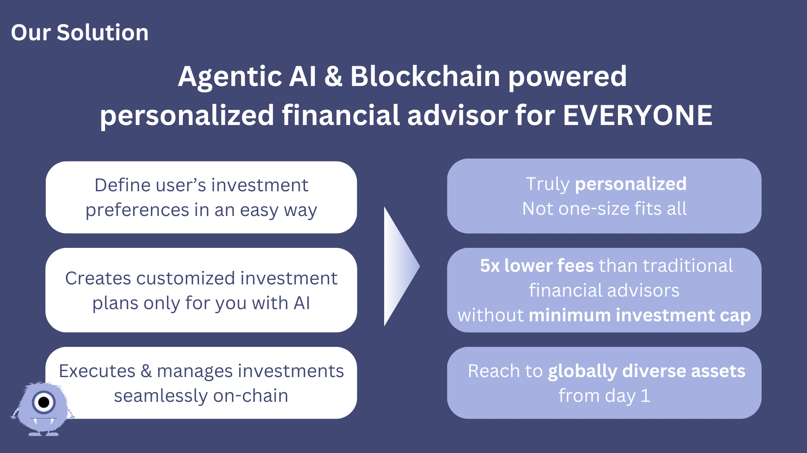
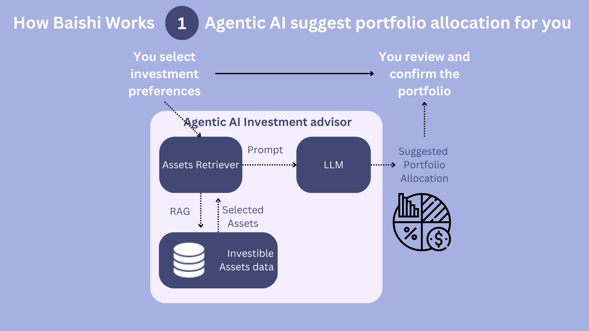
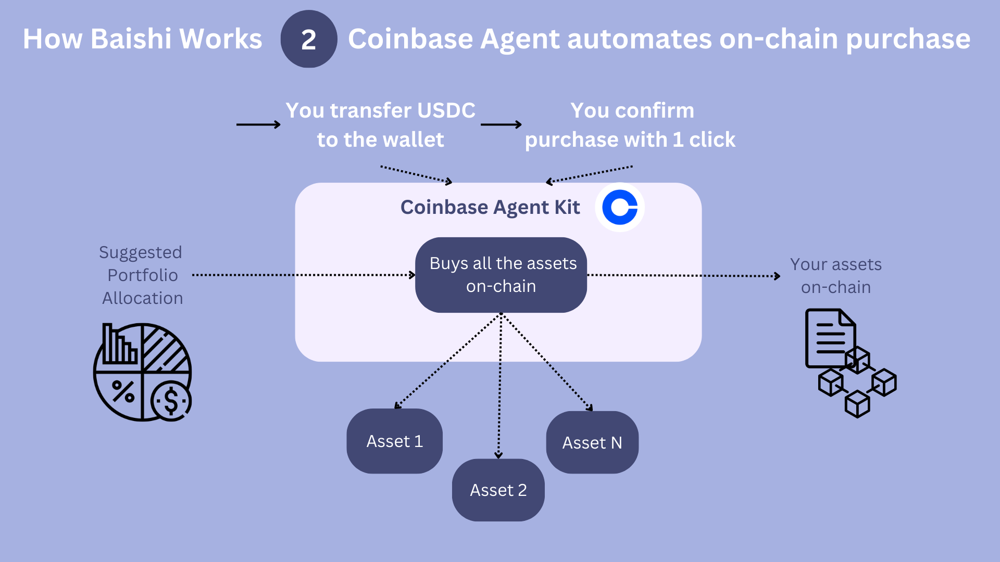
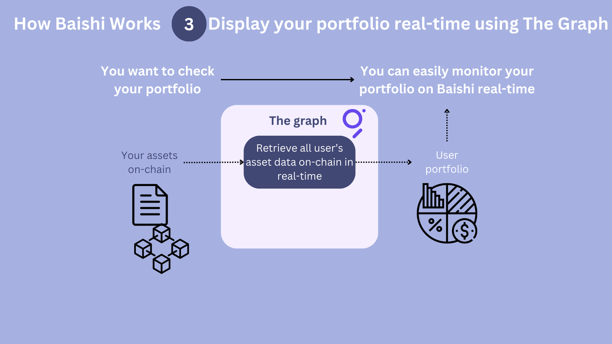

     

> Try our product: [here](https://baishi.up.railway.app/)

# Bai Shi - Whiterock

Bai Shi (白石 or white rock) is a financial advisory service powered by multiple AI agents. We guide you in discovering your unique financial objectives, curating personalized strategic asset allocations, and seamlessly managing on-chain investments on your behalf.

We believe that as RWAs (Real-World Assets) move on-chain, investors will face an overwhelming surge of opportunities. By leveraging large-scale intelligence through LLMs, we democratize financial advisory services—making them accessible to everyone, not just the wealthy. We will disrupt this ~$100 billion market by eliminating unnecessary intermediaries and drastically reducing fees.

     

### Why Us:

     

1. **We are much cheaper**: 5x lower fees than traditional financial advisors without minimum investment cap

2. **Truly personalized**: We use LLMs to understand your risk preference and create a personalized strategic asset allocation for you.

3. **Reach to globally on-chain assets from day 1**: Our investment choices are on-chain assets including bonds, stocks, real-estate, cryptocurrencies, etc.

### Technology Stack:

- **Smart Contracts**: Solidity
- **Blockchain**: Base Sepolia
- **Agent**: Coinbase Agent Kit, Langchain
- **Blockchain Interaction**: Wagmi
- **Wallet**: Reown
- **Frontend**: Next.js
- **Backend**: Node.js
- **Database**: Airtable
- **Vector Database**: Chroma
- **Indexing**: The Graph
- **AI Model**: gpt-4o-mini

### How It Works

     

     

     

1. **Sign In with Ethereum**: Connect your wallet and sign to authenticate.

2. **Create Your Financial Objectives and Risk Preference**:
   - Tell us about your investment goals
   - How much do you want to invest?
   - How much risk are you comfortable with?
   - Which assets do you like?

3. **Agentic AI create strategic asset allocation just for you**: We let LLMs to create a strategic asset allocation just for you.

4. **Pay with USDC**: Invest with stablecoin.

5. **Monitor your portfolio**: We will monitor your portfolio and make adjustments as needed.

### How it's made
We use reasoning LLM to understand the investor's risk preference and translate that into strategic asset allocation by using the RAG technique.  We use AgentKit by Coinbase to handle on-chain transactions on behalf of our users. And let the Graph do indexing for calculating financial information on-chain for us. 

### Challenges

- Choices of on-chain assets are limited nowsaday
- API to buy assets on-chain easily
- Oracle to check if the user are eligible for the investment

### Project Structure
The project is split into 4 packages:

- `contract`: contains the smart contracts
- `frontend`: contains the frontend app
- `agent`: contains the backend and agentic API
- `the-graph`: contains the The Graph setup

### Deployed Contract Address
Base Sepolia Testnet
[0xbc4AA9cE14769bA3e52fe38a4E369DF483169e99](https://sepolia.basescan.org/address/0xbc4AA9cE14769bA3e52fe38a4E369DF483169e99)

AUM of the global financial advisory market is ~$100 billion. 
We believe we can disrupt this market by using AI to make financial advisory more accessible to everyone.
